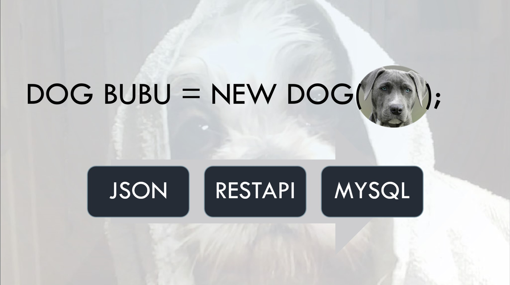
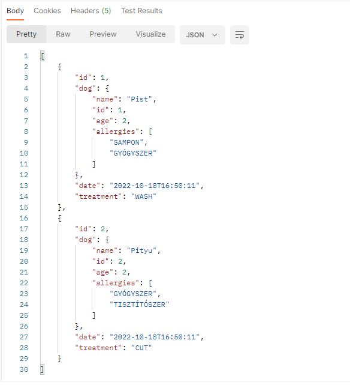
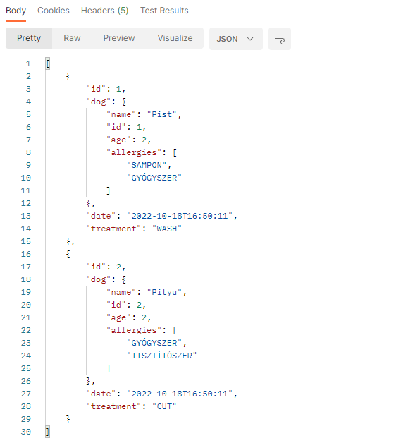
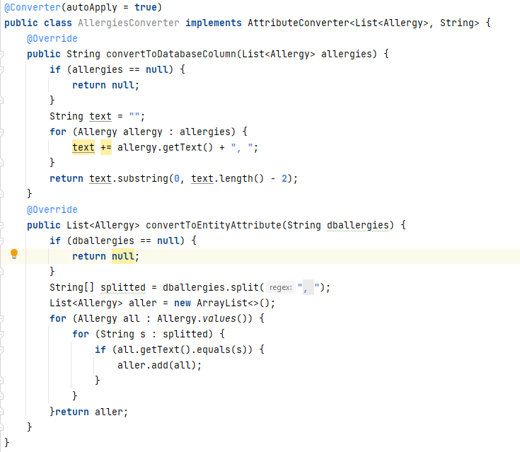

<!-- PROJECT LOGO -->
 

 
 
 

<h3 align="center">Grooming app with MySQL and RestApi </h3>

  

    Appointment booking app with Java and MySQL 
     
  

<!-- TABLE OF CONTENTS -->

  
Table of Contents

  <ol>
    <li>
      <a href="#about-the-project">About The Project</a>
      <ul>
        <li><a href="#built-with">Built With</a></li>
      </ul>
    </li>
    <li><a href="#usage">Usage</a></li>
    <li><a href="#roadmap">Roadmap</a></li>
    <li><a href="#contact">Contact</a></li>
  </ol>

<!-- ABOUT THE PROJECT -->
## About The Project

 
 
In this project I'd like to use Enums in the databes as a list, as its shown in the picture. It's quiet redundant, but was an interesting challenge, and maybe useful for someone. 

(<a href="#readme-top">back to top</a>)

### Built With

* Java
* MySQL

<!-- USAGE EXAMPLES -->
## Usage
Converter makes a good job, we can simply use the list of allergy Enums from the database.

 
 
 

(<a href="#readme-top">back to top</a>)

<!-- ROADMAP -->
## Roadmap

- [ ] Converter for Enums
- [ ] Create, post, modify and delete pet or appointment from databese with Json object.
- [ ] Near future
    - [ ] add owners
    - [ ] add groomers
    - [ ] security features

<!-- CONTACT -->
## Contact

Krisztina Kövér  - info@webby.hu

(<a href="#readme-top">back to top</a>)

